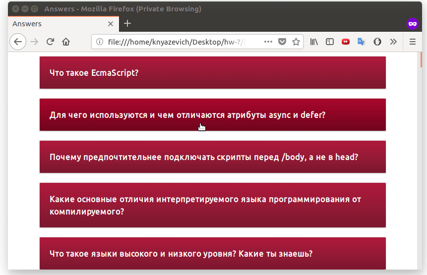

# Домашнее задание

Создай ветку __events__. 

1. В файле `app/pages/answers.html` ответь на некоторые вопросы. Каждый ответ оформляется следующим образом:

```html
<div class="pair events">
	<p class="question">Что такое осень?</p>
	<p class="answer">Это небо.</p>
</div>
``` 

Копировать и вставлять готовые ответы нельзя. Теорию читать можно и нужно. В файле `Additional.md` я дал ссылки на некоторые хорошие источники, обрати на них внимание.

## Вопросы

1. Что такое событие? Какие бывают события?
1. Как можно привязывать обработчики к событию? Какие есть недостатки у разных способов привязки к событиям?
1. Что такое "делегирование"? В чем преимущество использования делегирования?
1. Как удалить обработчик события?
1. Чему равен `this` в функции-обработчике события? Какая есть особенность у стрелочных функций и `this`?
1. Что такое "захват" и "всплытие". Какую роль они играют?
1. Что такое объект Event? Какую информацию он хранит?
1. Как отменить событие по умолчанию?
1. Как остановить "всплытие" на каком-то элементе? Почему это нужно делать с осторожностью?

2. Для файла __answers.html__ подключаем __style.css__ и __common.js__.

Все пары вопрос-ответ нужно представить в виде аккордеонов, которые будет выглядеть следующим образом:



### Дополнительные требования

* Можно делать с анимацией или без анимации;
* В файле [__gradients.css__](gradients.css) лежит код градиентов, которые должны быть использованы;
* Работать аккордеон должен для всех вопросов. При нажатии на один вопрос, посторонние ответы не должны открываться;
* Для написания нельзя использовать циклы, событие должно вешаться с использованием делегирования;
* Код должен быть [транспилирован в ES-5 и минифицирован](http://babeljs.io/repl).
* Стили должны быть с [префиксами](http://autoprefixer.github.io/) и [минифицированы](http://cssminifier.com/).

---

#### Расчетное время выполнения: 2 - 4 часа.